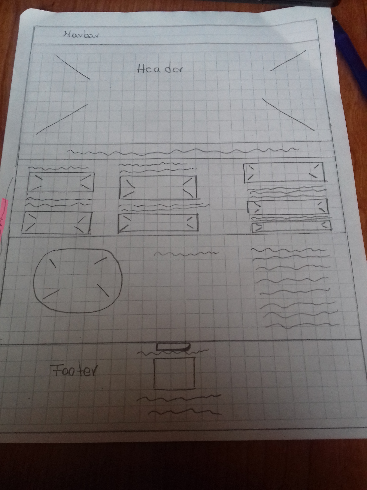
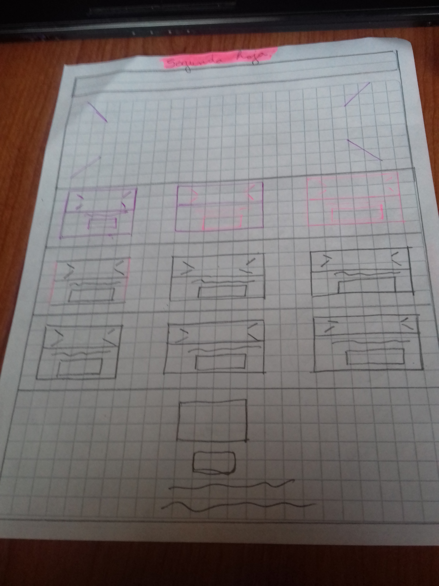

https://github.com/betzabe2012/final_1.git

README.md

#requisitos

1. Trabajar de forma individual.

2. Seleccionar un tema (ver los temas más abajo).

3. Crear un repositorio para el proyecto final (primer commit).

4. Crear el archivo README.md en la raíz del proyecto donde irán descripciones e
instrucciones (segundo commit).

5. Crear la estructura de Directorios (tercer commit).

6. Agregar al archivo readme.md las definiciones escritas de:
El tema seleccionado
Los objetivos para la interfaz (ui) y para la experiencia del usuario (ux).
Los requerimientos del sitio
La definición de layout (tipo de página).
El boceto a mano (como imagen agregada al README.md y a la carpeta
images del directorio (cuarto commit))

7. Realizar un Mockup del home con HTML, CSS y Bootstrap (quinto commit).

8. Versionar todo a través de GIT y gestionarlo por GitHub.

##elección de Tema

4. Tripadvisor de la comuna:
Debe contener como mínimo secciones de hitos turísticos en quilicura,
arte callejero, arquitectura, gastronomía, lugares imperdibles y contacto.

El proyecto debe considerar la implementación de los siguientes items:
Distribución (4 puntos)

Temas para el Proyecto
Evaluación (puntaje por ítem)

Creación de repositorio (1 punto)

Git & Github (1 punto)

README.md (descripción e instrucciones) (1 punto)

Creación de estructura de directorios (1 punto)

Ideación (4 puntos)

Objetivos para la interfaz y para la experiencia del usuario (1 punto)

Requerimientos del sitio (1 punto)

Definición de layout (1 punto)

Boceto a mano (imagen agregada a README.md y a carpeta images) (1
punto)

HTML5 (3 puntos)

Uso correcto de etiquetas (semántica) (1 pto)

El uso del meta viewport en cada página (1 pto)

Sintaxis e indentación correcta (1 punto)

CSS (4 puntos)

Utilizar una hoja de estilo llamada de forma externa (1 punto)

Uso de display block e inline-block (1 pto)

Uso de al menos 2 reglas de position (1 pto)

Uso de al menos 2 medias querys personalizadas (1 pto)

Bootstrap 3 (3 puntos)

Uso correcto del sistema de grillas (2 pto)

Incorporación de al menos un formulario con estilos de Bootstrap (1 pto)

Responsive (4 puntos)

Correcta visualización en xs, sm, md y lg (4 pto)

Información (1 puntos)

Creación de contenido original, sin uso de Lorem Ipsum (1 pto)

Se debe subir el link del repositorio a la plataforma Empieza.

Fecha de entrega proyecto: 28 de Junio 2018.

Fecha de entrega evaluación: 04 de Julio 2018.

## Requisitos 

1- pagina responsiva

2- colores suaves y calidos

3- incapie en la Gastronomía y Restauranes

3- Fotos de calidad y con buena resolución

4- Grilla que haga dinamica la pagina

5- que no tenga tantos botonos o link de ingreso

6- pagina simple y sencilla

7- que mencione los mejores Restauranes de la Comuna

8- que tenga espacio para los micro empresarios gastronomicos y emprendedores

9- pagina landing Page.

10- hacer enfasis en los menus.

11- concurrir a los restauranes

12- hablar con sus dueños

13- sacar fotos a sus locales

14- preguntar por sus redes sociales

#Requisitos ui

que sea claro para el usuario

de colores neutros

que sea facil de utilizar por personas mayores y niños

que muestre fotos reales y historias de la ruta 

que sea de facíl ingreso

que no tenga tantos botonos para linkear

##requisitos ux

que muestre lugares que la gente reconozca

lugares típicos de la comuna

que muestre reseña y nos inste a querer ingresar a las historias.

que sea muy facíl acceder al sitio

#imagenes

